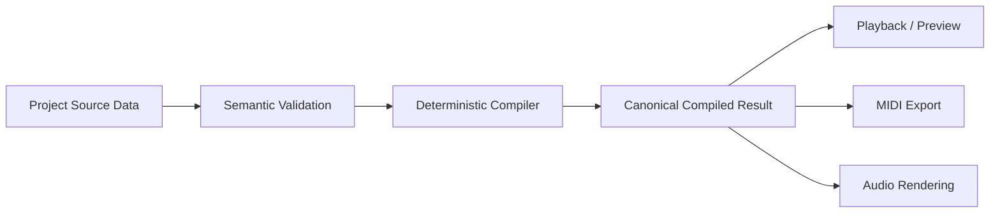
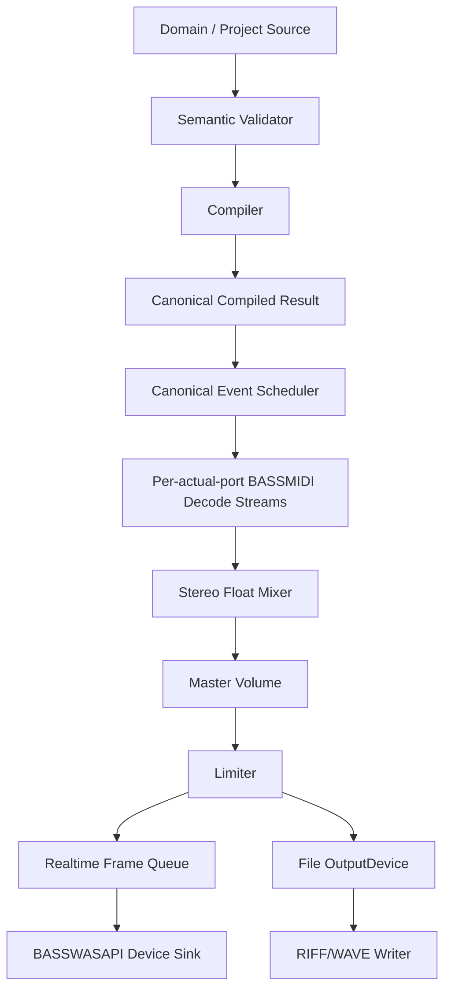

# Midora 初版实施路线图

文档修订日期：2026-08-08
性质：需求理解、现状审阅和实施建议；不是 SRS 的替代品。

> 2026-09-18 B1 实施：在 A4b `caf8cec` 基线上完成 [工作区状态归属与同轨道设置共享](Midora-Next-Development-Requirements-2026-09-11/execution/05-Workspace-State-and-Track-Navigation.md) 的10个子项，待6项人工检查整体验收；[实施证据与样例入口](Midora-B1-Workspace-State-Implementation-2026-09-18.md) 单独归档。B2/B3 保存/恢复未实施，现行文件格式不变。本轮不提交、推送或发布；以下验收段保留其各自历史授权。

> 2026-09-18 最新批次：A1～A4b 及已记录返修获用户验收。A4b 正式边界与实测见 [报告](Midora-A4b-Template-Timeline-Feedback-2026-09-17.md)和[当前执行索引](Midora-Next-Development-Requirements-2026-09-11/execution/00-Execution-Plan.md)。追加 Loop/Pre-Roll 手柄、右键编辑、编译旋转/黄色提示、Template 蓝色标签和四种手柄圆角柔化也均已获明确验收，见 [追加记录](Midora-A4b-Marker-Editing-Followup-2026-09-17.md)。本轮按用户要求归档、提交和推送，不本地发布；逻辑参数类型约束强化仍延期，B/C 未启动。后文旧进度保持历史原貌。

> 2026-09-14 最新开发批次：A1 原清单与返修、A2a 统一乐器选择器／Inst. 单点／Initial State／preset audition 的 6 项人工验收均已获用户通过。source 关联要求当前 writer 为 Project Format 4，保留 Format 1/2/3 reader 和安全迁移副本；应用仍 `1.0.0-dev`。实际测试、9KX2 数据层测量、未跑专项及用户原答见 [A2a 报告](Midora-A2a-Instrument-Changes-Implementation-2026-09-14.md)。本次按要求记录并提交／推送，不发布；下一切片 A2b 全编辑与 Lane Tabs 尚未开始，当前不宣称 R27 全部完成。本段之后的旧进度保持历史原貌。

> 2026-09-10 最新状态：**Logical 编译结果内存/时间优化（含 LC-T3）与极端 Tick UI 防护均已人工验收；SMF 导出编码边界已实施并完成自动验证，待本轮人工验收，然后进入新一轮需求**。初次时间退化保留在[历史内存报告](Midora-Logical-Canonical-Memory-Verification-2026-09-10.md)，时间回收见[时间优化记录](Midora-Logical-Canonical-Time-Implementation-2026-09-10.md)。SMF 的超长 delta 填充、每 MTrk 数据区 `0xFFFFFFFF` 字节上限/不拆分、流式事务与导出级汇总已落地，Compiler 不增加 delta/字节扫描；范围、实际测试与未覆盖的大文件 I/O 边界见[SMF 实施记录](Midora-SMF-Encoding-Boundaries-Implementation-2026-09-10.md)和[下一步台账](Midora-Pre-Expansion-Closeout-and-Next-Step-2026-09-09.md)。

> 现状提示（2026-08-08）：本文后续“当前进度/尚未实现”描述保留为历史路线记录，已经过时；不得据此判定源码缺口。当前权威实施状态见 `misc/Midora-Non-UI-Implementation-Tracker.md`，§7～§12 逐节证据见 `misc/Midora-Domain-Compiler-Conformance-Matrix.md`。
>
> 2026-09-10 LC-T3：用户在独立实验后另行批准并正式接入紧凑 canonical/source 热路径，不改变既有预算、来源或音乐语义；现已确认本轮验收通过。当前验证与性能反例见 [LC-T3 实施记录](Midora-Logical-Canonical-Compact-Implementation-2026-09-10.md)；上述时间回收报告归档 T1/T2，后续极端 Tick/SMF 工作顺序不变。
>
> UI 阶段现状（2026-08-22）：正式 `Midora.Desktop`、共享 `Midora.Desktop.Presentation` 及其测试项目已经建立。主窗口、Project 生命周期、工作区、事务式对象 Properties、独立 Diagnostics、单前台 Task overlay、Preferences、MIDI/Audio 输出工作流和第 18 章主要编辑器已接入正式 Domain/Application/Compiler/consumer 入口；Arrangement、Segment、SubVoice、Logical Parameter 和 Conductor 的大量对象编辑采用专用渲染表面。生产主窗口已删除 Global Inspector、Bottom Panel 与 Details/Tasks；Style Gallery 继续作为同一共享主题的历史视觉样例，不是生产依赖。当前 UI 需求映射与验证证据见 `misc/Midora-WPF-UI-Requirement-Trace.md`，架构决定见 `misc/Midora-WPF-UI-Architecture-Decisions.md`。
>
> 规格修订提示（2026-08-18）：SRS 第 23 章已把 Pure MIDI Track 与 SMF Import 纳入初版，并限缩了本文关于“全部 Channel 10 melodic”“CC91/CC93 全局拒绝”“Logical-only Track/EOT”的旧描述。本文正文仍作为 2026-08-08 历史路线记录；现行实现与验证状态见 `misc/Midora-Pure-MIDI-Tracks-and-SMF-Import-Requirement-Trace.md`，规范仍以第 23 章、INV-050～INV-057 和 ADR-PMIDI-001～008 为准。
>
> Arrangement 修订提示（2026-08-20）：SRS 第 24 章已用 Conductor-first global mixed Track order、Event Instrument Definition 管理栏、内部 Event Instrument Usage/MIDI Channel Root 与 Shared brace 取代 2026-08-18 的可见 mixed parent/child tree。现行实现与验证状态见 `misc/Midora-Arrangement-Hierarchy-and-Preview-Requirement-Trace.md`；规范以第 24 章、INV-058～064、INV-073～074、ADR-CORE-046、ADR-UI-040～041 与 ADR-PMIDI-009 的取代说明为准，本文旧 UI/Library 描述仅是历史记录。

## 1. 审阅范围

已审阅：

- `misc/Midora-SRS-Initial-Release-v0.1/` 下 00～24 共 25 份 Markdown SRS。
- `src/` 下现有 solution、project、非生成 C# 源码与 BASS native 获取脚本。
- Un4seen 官方 BASS、BASSMIDI、BASSWASAPI 文档及当前授权页。

2026-08-05 已按用户确认结果修订 SRS、路线图和仓库提示词；本轮仍不修改现有源码。

## 2. 对产品的核心理解

Midora 初版不是通用 DAW，也不是 MIDI 文件编辑器外加播放器。它的核心是一套确定性的音乐语义编译系统：用户编辑 Project、Event Instrument、SubVoice、Logical Parameter、Lifecycle、Logical Track 和 Segment；编译器把这些高层对象展开成唯一的 Canonical Compiled Result；播放、预览、MIDI 导出和音频渲染只消费该结果。

因此实施工作的第一优先级不是把 BASS 原型扩成播放器，而是先固定领域模型、时间/范围、诊断、资源占用和 canonical result 契约。否则音频层会被迫重新解释业务语义，最终无法同时满足播放、导出、渲染及增量编译一致性。

### 2.1 已确认的关键约束

- 技术边界：Windows Desktop、.NET 10、WPF、MIDI 1.0、`win-x64`；仅允许一个用户可启动的 Midora UI/Project 应用实例同时打开一个 Project。正式音频后端固定为一个无 UI、不能独立打开或解释 Project 的完整内部音频子进程；Worker 固定按 `win-x64` Native AOT、自包含发布，不向用户提供拓扑切换设置。
- 时间：Project 创建时确定 TPQ，默认 192，之后不可修改；tick 使用有符号 64 位；所有正式范围是左闭右开 `[startTick, endTick)`。
- Conductor：Project 恰有一条 Conductor Track；tick 0 必须有有效 Tempo 和 Time Signature；初版只支持离散 Tempo，不支持 ramp。
- 身份：对象使用 Project 全局稳定 ID；引用不得依赖名称、位置、tick、Port 或 Channel。
- 资源：最多 16 个 Port，每 Port 16 个 Channel Unit，共 256；实际使用多少 Port 就创建多少 BASSMIDI stream；Channel Group 原子分配、低编号优先，不做语义级 Voice Stealing。BASSMIDI sample voice 上限属于独立后端资源配置。
- Channel 10：所有 Port 的 Channel 10 都是 melodic，不使用 General MIDI drum 默认语义。
- MIDI 效果：所有正式 BASSMIDI stream 必须使用 `BASS_MIDI_NOFX`；Midora 完全不支持 CC91 Reverb Send 和 CC93 Chorus Send。它们不得进入编辑器、初始状态、Mapping、Canonical Compiled Result 或 MIDI 导出；源数据出现时属于语义 Error。
- SoundFont：一个 Project 一个 SF2；缺失/损坏不妨碍打开、编译和 MIDI 导出，但阻止所有正式发声和音频渲染。
- 编译：Canonical Compiled Result 包含全局/分 Port 事件、来源、资源占用、诊断、统计、可消费性和 partial 状态；失败的 partial result 不可被消费者使用。
- 确定性：Full Compile 和 Incremental Compile 必须形式等价；分配结果不能受历史状态影响；缓存只优化速度，不能改变结果。
- 状态与边界：范围起点恢复必要的非 Note 状态，但不能重触发起点前已开始的 Note；Segment/End Marker/渲染 end 是硬边界，必须精确 NoteOff 和 Reset，不能让 release/tail 越界。
- 播放：单一活动播放/预览任务；无 Pause；Preparing/Playing/Buffering 期间锁定 Project 编辑；Mute/Solo 只做运行时过滤。
- 实时设备：列出全部启用的音频输出设备并标记系统默认设备；排除输入、loopback、禁用、未连接和不存在的端点。播放采样率跟随所选设备实际采样率；设备或采样率变化会使 sample-domain 缓存和相关 stream 失效并重建。
- 缓冲设置：用户直接设置 Render-Ahead Buffer（20～2000 ms，默认 100 ms）和 Device Buffer Request（5～200 ms，默认 50 ms）。只允许在 Stopped 修改；设备实际 buffer/callback period 为只读运行时信息。实时 PCM 不跨进程，运行时命令/状态使用固定容量共享内存 ABI，不提供 IPC PCM buffer 设置。
- 性能：在正确性、确定性和有界资源约束内，时间性能优先于最小空间占用，允许用预计算、缓存和双/三/四缓冲换取速度。Playing、Buffering、实时预览和文件 Rendering 期间，参与音频活动的线程不得产生托管堆分配；Preparing、Finalizing 及其他线程/进程不受此零分配约束。
- 延迟：从视觉上音符应播放到听到声音的端到端延迟以约 200 ms 作为性能测试基准；它不是软件运行时判定、自动调参或阻止播放的逻辑阈值。内部音频子进程的控制 IPC 延迟计入该基准。
- 输出链：所有实际 Port 先混合为 stereo，再经过 Playback Master Volume（默认 -0.1 dB）和 Limiter，然后进入设备或文件。
- MIDI 导出：SMF Type 1，使用 Project TPQ；以 canonical result 为唯一内容来源；真实 NoteOff velocity 0；支持整曲、按 Logical Track、按 Port。
- 音频渲染：Whole Mix 或 Per Logical Track；普通 RIFF/WAVE、stereo、interleaved IEEE float32 little-endian；任务采样率允许 8000～192000 Hz 的任意整数，默认 48000 Hz。渲染使用独立文件专用 `OutputDevice` 抽象，不依赖 WASAPI 或物理设备，并采用分块流式、事务发布和强制最终 Limiter。Preparing 必须精确预检 RIFF 可表示大小，任何目标超限都以 Error 阻止整个任务，不自动拆分、不回退 RF64、不降低采样率。
- 输出命名：MIDI 与音频共用确定性的 Windows 安全文件名合法化和冲突检测；算法固定为 NFC、固定不安全字符表、设备保留名前缀、255 UTF-16 code unit、text-element 截断和稳定 ` (n)` 冲突后缀。Review 预览并冻结全部最终路径，合法化不回写源名称，已有目标不参与后缀分配且覆盖仍需明确授权。整曲、分 Track、逐 Port、Readme 和 MIDI Track Name 模板已经由 23.2A 固定，多文件模式不自动增加嵌套目录。
- 持久化：`.midora` 是固定结构 ZIP，轻数据 JSON、重对象 protobuf；只保存源数据；严格 schema/version；确定性序列化；Save 采用同目录临时文件、重开校验和原子替换。
- UI：单 WPF 主窗口；Project/工作区/事务式对象 Properties/独立 Diagnostics/单前台 Task overlay/Status 分区；无 Global Inspector、Bottom Panel 或可见 Task History；界面只操作正式模型，不重建编译语义。

### 2.2 明确不在初版范围内

MIDI 2.0、VST/DAW host、传统实时 MIDI OUT、录音、Pause/Scrub、语义级 Voice Stealing 策略、Channel 10 鼓通道、每 Project/Port/Track/Instrument 独立 SoundFont、DLS、多 Project、自动保存/崩溃恢复，以及 SRS 第 21 章列出的其他排除项。程序级有序多 SF2/SFZ 列表属于已确认范围；已确认的 BASSMIDI sample voice 资源上限除外。

## 3. 现有源码基线

### 3.1 构建结果

以下结果是 2026-08-04 的审阅快照。2026-08-05 本轮只修订文档，未重新构建，因此它不声明当前含用户改动的工作树仍具有相同结果。

使用 .NET SDK `10.0.302`、`dotnet build <solution> --no-restore` 顺序验证：

| Solution | 结果 | 说明 |
|---|---:|---|
| `midora-common.slnx` | 通过 | 0 warning / 0 error |
| `midora-midi.slnx` | 通过 | 0 warning / 0 error |
| `midora-native-interops.slnx` | 通过 | 0 warning / 0 error |
| `midora-audio-device.slnx` | 通过 | 0 warning / 0 error |
| `midora-audio.slnx` | 失败 | `BassMidiPort` 未实现当前 `IMidiPort.EnqueueMessages(long, MidiMessage*, uint)`，CS0535 |

首次并行构建多个 solution 时，它们同时编译共享项目，产生 `obj` 输出文件锁；顺序构建后前四个 solution 正常，因此该锁冲突不是源码缺陷。

### 3.2 已确认的原型性质与问题

- `Midora.Midi` 已按 21A 实现确定性 SMF Type 1 writer/validator；`Midora.MidiExport` 已有整曲 canonical 编码，并按 22A 实现每个相关事件 Track 的 GS→XG Channel 10 melodic 初始化。多文件模式、Compact Routing、Readme 和文件事务仍未实现。
- `BassMidiPort` 的消息排队、推音频和 reset 尚未实现完整；当前接口签名已分叉，solution 无法整体构建。
- 事件由测试程序即时调用并依赖 `Thread.Sleep`，只能证明设备能够发声，不能证明 tick/sample 调度正确。
- 当前原型使用 `BASS_MIDI_NOFX` 的方向符合已确认需求；正式实现仍缺少 CC91/CC93 全链路拒绝、状态清理和一致性检查。
- 当前 WASAPI wrapper 没有完整封装 callback delegate/GCHandle、`BASS_WASAPI_Free`、异常边界、错误码、短读和设备变化。
- console test 使用本机硬编码 SF2 路径及固定设备假设，只能保留为人工 smoke test，不能作为验收依据。
- native interop 层虽然可以构建，但“能编译”不证明 P/Invoke ABI、结构布局、返回值宽度和生命周期正确，必须对照官方 C header 做逐项测试。
- 当前工作树已有用户修改和删除项；后续工作必须逐文件保护，不能 reset、覆盖或把无关改动并入任务。

结论：当前代码可以作为 BASS 能在目标机器上发声的技术证据；不宜在现有 `IMidiPort`/`IAudioRenderSource` 草案上直接堆叠正式系统。

## 4. BASS 官方资料带来的设计约束

以下是官方文档事实，不是从原型反推：

- `BASS_MIDI_StreamEvents` 支持结构化事件和相对/绝对时间位置；`BASS_MIDI_EVENT.pos` 使用 byte position，可让事件时序脱离 UI/调用线程的睡眠精度。正式实现应利用这一能力或等价的分块边界调度，并证明两者在各种 block size 下结果一致。
- BASSMIDI stream 默认把 Channel 10 当鼓通道，Midora 必须在每个实际 Port 的干净状态中显式关闭该默认语义。
- `BASS_MIDI_NOFX` 会关闭 chorus/reverb；已确认所有正式 Midora BASSMIDI stream 必须使用该标志，且 CC91/CC93 在领域与编译层即被拒绝。
- `BASS_MIDI_NOTEOFF1` 只让 NoteOff 释放同 Port、Channel、pitch 中最早开始的一个重叠实例；不启用时会一次释放全部匹配实例。13A 已固定正式 stream 启用该标志，并以真实 BASSMIDI 的 overlap、Cut Previous、reset 和 velocity `0` NoteOff 测试锁定。
- WASAPI callback 的 sample data 固定为 float32、长度参数是 byte count；回调必须快速返回。exclusive mode 短读时其余部分由 BASSWASAPI 填静音；不能从 callback 内调用 `BASS_WASAPI_Free`。
- BASS 错误码是线程相关状态；每个失败调用后应立即在同线程获取并转成 Midora 自己的错误对象。
- 官方要求用各模块 `GetVersion` 校验加载 DLL 与 API 版本。16A 已固定 BASS 2.4.18.3、BASSMIDI 2.4.16.0、BASSWASAPI 2.4.4.1 的完整版本码和 win-x64 DLL SHA-256；仓库 manifest 是正式清单，vendor current/latest 仅为开发候选。
- Midora 初版已确定为免费、开源、非商业软件，自有源代码使用标准 MIT License；项目自身非商业不限制下游商业使用。BASS 官方免费使用条件还取决于实际发布主体为非商业实体，且产品不通过销售、广告等获利；开源或免费下载本身不是充分条件。正式发布仍须核验主体、收入、平台、分发方式、届时有效条款和第三方 notices；条件不明或商业化时先联系权利人或取得适用许可。

官方参考：

- [BASS 产品、版本和授权](https://www.un4seen.com/bass.html)
- [BASS 文档索引](https://www.un4seen.com/doc/)
- [BASS_MIDI_StreamCreate](https://www.un4seen.com/doc/bassmidi/BASS_MIDI_StreamCreate.html)
- [BASS_MIDI_StreamEvents](https://www.un4seen.com/doc/bassmidi/BASS_MIDI_StreamEvents.html)
- [BASS_MIDI_StreamSetFonts](https://www.un4seen.com/doc/bassmidi/BASS_MIDI_StreamSetFonts.html)
- [BASS_WASAPI_Init](https://www.un4seen.com/doc/basswasapi/BASS_WASAPI_Init.html)
- [WASAPIPROC callback](https://www.un4seen.com/doc/basswasapi/WASAPIPROC.html)
- [BASS_WASAPI_SetNotify](https://www.un4seen.com/doc/basswasapi/BASS_WASAPI_SetNotify.html)
- [BASS_GetVersion](https://www.un4seen.com/doc/bass/BASS_GetVersion.html)

## 5. 建议的目标架构

本节是设计建议；SRS 规定行为，未规定这些具体类名或程序集边界。

### 5.1 层级职责

1. **Domain/Core**：稳定 ID、Tick/Range、Project、Conductor、Event Instrument、SubVoice、Logical Parameter、Lifecycle、Track/Segment；不引用 BASS/WPF。
2. **Validation/Diagnostics**：语义验证、来源定位、严重级别、可消费性；诊断可从 UI 导航回正式对象。
3. **Compiler**：展开、映射、生命周期、NoteOff/Reset、同 tick 顺序、资源分配、范围恢复、provenance、statistics、checkpoint 和 dirty-range convergence。
4. **Consumer contracts**：只接受冻结的 Canonical Compiled Result/CompileContext；不接受 Project 对象以避免重新解释。
5. **Audio engine**：tick→sample、BASSMIDI event 转换、每实际 Port stream、float mixer、Master/Limiter；实时和离线共享该层。
6. **Realtime device adapter**：只处理 frame queue、WASAPI 设备生命周期、通知、underrun 和 Buffering，不知道 Project 语义。
7. **File OutputDevice / RIFF writer**：以任务采样率消费同一 audio engine 的输出，负责 RIFF 大小预检、固定长度、NaN/Infinity、取消、校验和原子发布；它不是物理设备，也不使用 WASAPI。
8. **Application/UI**：任务状态机、锁定、Undo/Redo、WPF 工作区、设备与缓冲 preference 和 session state。

### 5.2 音频接口建议

不要继续用仅返回“若干 byte”的模糊接口。建议至少区分：

- `AudioFormat`：sample rate、channel count、float32 格式和 bytes/frame，构造时验证且不可变；实时实例使用设备实际采样率，文件实例使用任务采样率。
- `AudioFrameBlock`：以 frame 为长度单位的 interleaved stereo span，byte 换算只留在 native 边界。
- `IAudioFrameProducer`：离线/worker 线程上的确定性 pull，可报告 Produced/End/Fault/Canceled。
- `IRealtimeAudioQueue`：单生产者/单消费者的预分配 ring buffer，回调只读；显式 underrun 计数。
- `IAudioOutputDevice`：统一表达物理设备目标和文件目标；Prepare/Start/Stop/Dispose，不接受 Project 或 MIDI event。只有物理设备实现暴露设备事件，文件实现负责 RIFF 事务写入。

接口名可以调整，但必须保留这些信息边界。

### 5.3 BASS 生命周期建议

- 一个进程级 `BassRuntime` 负责 DLL resolver、版本检查、`BASS_Init`/`BASS_Free`、模块引用计数和线程错误提取。
- `SoundFontHandle`、MIDI stream 和 WASAPI session 使用明确所有权的 SafeHandle/等价封装；销毁幂等且顺序固定。
- callback delegate 与 user context 的强引用必须覆盖 native callback 的整个生命周期；先停止并确认 callback 不再进入，再 free native session，最后释放 GCHandle。
- 音频 worker 提前把 canonical events 转成带 absolute sample position 的不可变批次；WASAPI callback 不执行 Tempo Map、编译或 MIDI 展开。
- Playing、Buffering、实时预览和文件 Rendering 阶段的音频活动线程只复用 Preparing 中预分配的固定缓冲、事件批次和队列节点，不创建托管对象；允许按基准测试采用双缓冲、三缓冲或四缓冲。
- 固定内部音频子进程的 Preparing 输入只包含已冻结的消费计划与已解析设置，运行时 IPC 只传输控制命令和状态；实时音频帧不跨进程。子进程不能读取或解释 Project。需要分别测量命令排队、共享内存读写、轮询/唤醒与状态回传延迟。
- 正式结果的同 tick 次序必须在送入 BASS 前固定；不要依赖 BASS 自行排序解决 Midora 语义优先级。
- 对每个 native 失败记录模块、函数、错误码、设备、stream/port 上下文和安全的恢复建议；不得只返回 `false`。

## 6. 分阶段工作步骤

每个阶段都必须有可运行的垂直证据和退出条件。阶段编号表示依赖顺序，不代表必须一次性完成整个阶段才提交代码。

### 阶段 0：规格对齐和工程基线

工作：

1. 建需求追踪表，把 INV-001～INV-020 与各模块、测试套件对应。
2. 将第 9 节仍需选择的实现内容写成版本化 ADR；不得重新打开已确认的规格决定。
3. 使用已确认的 `win-x64` BASS manifest 和操作员提供的官方二进制完成正式发布输入；按 24A 核验非商业免费使用条件并随产物提供第三方 notices。
4. 建立一个不会并发重复编译共享项目的仓库级 build/test 入口；保留小 solution 还是合并 root solution 可另作工程决策。
5. 把人工 console 发声程序标为 smoke 工具；建立真正的 unit/integration/conformance test 工程。

退出条件：干净环境可以一条命令构建全部项目；当前 CS0535 消失；所有未决设计有明确 owner/ADR，而非散落在代码默认值中。

### 阶段 1：不可变基础类型与 Project 领域模型

工作：

1. Stable ID、Tick、非空 Range、TPQ、Tempo/Time Signature、强类型 MIDI 值、参数 key 和确定性排序比较器。
2. Project/Conductor/Event Instrument/SubVoice/Mapping/Lifecycle/Logical Track/Segment 的源数据模型及跨对象引用。
3. 严格区分 Project State、Application Preferences、Session UI State、Transient Task State 和 Derived Cache。
4. Command/Undo 事务边界；批量编辑要么整体成功，要么不修改。
5. Semantic Validator 与带稳定来源的 diagnostics。

退出条件：可以在内存中构造最小/边界 Project，验证所有核心 invariant；领域层不引用 WPF 或 BASS。

### 阶段 2：Canonical Compiler 最小垂直切片

先只覆盖：一个 Project、一个 Logical Track/Segment、一个 Event Instrument/SubVoice、Note + Program/Bank/CC、单 Tempo、无复杂 Mapping/Loop。

工作：

1. 定义 `CompileContext`、Canonical Result schema、provenance、occupation、diagnostic 和 consumability。
2. 实现 NoteOn/真实 NoteOff、初始状态、Reset、同 tick 排序和低编号 Channel Unit 分配。
3. 实现全曲与非零范围编译，证明起点不重触发旧 Note、终点精确截断。
4. 建 binary/text golden representation，仅供测试；不得把 result 写进 `.midora`。

退出条件：一个简单 Project 经 compiler 后，播放/MIDI/渲染测试适配器看到完全相同的 canonical events；重复运行结果逐字段一致。

### 阶段 3：严格音频核心垂直切片

工作：

1. 重做 native runtime/handle/error/version 层，逐项核验官方 header ABI。
2. 建每实际 Port 的 BASSMIDI float32 stereo decode stream，设置统一 SF2、`BASS_MIDI_NOFX`、melodic Channel 10 和必要属性；验证 CC91/CC93 不会到达后端。
3. 按已确认的 decimal 分段积分与单次 `AwayFromZero` 规则生成 canonical sample positions，以其驱动 BASS 事件。
4. 建 block-size-independent mixer、Playback Master Volume 和实时/离线共用的 Limiter v2。
5. 建预分配 realtime queue 和最薄 WASAPI callback；只枚举启用的输出设备，完成默认设备标记、通知、实际采样率、start/stop/reset/free 和错误恢复。
6. 实现 Render-Ahead 与 Device Buffer Request 两项用户缓冲设置及 Stopped-only 重建规则；证明音频活动线程及运行时控制 IPC 热路径在正式活动阶段无托管堆分配。
7. 建无需声卡的文件 `OutputDevice`/离线内存 sink，用于 CI 验证自定义采样率、时序、状态和数值。
8. 完成固定内部音频子进程：Worker 独占全部原生音频后端与设备 callback，按显式 `win-x64` RID Native AOT 发布；运行时命令/状态使用有界共享内存 ABI，并分解测量 IPC 延迟、underrun、CPU 和约 200 ms 端到端延迟。

退出条件：在 64/128/256/511/1024 等不同消费 block size 及多种合法采样率下，事件 sample position、长度和状态符合统一规则；正式 producer 最大工作块保持 256 frames；活动音频线程和控制 IPC 热路径分配计数为零；循环 start/stop/reset 无 handle/GCHandle 泄漏；设备断开不会有异常跨 native 边界；Native AOT Worker 有可复现的故障恢复和延迟基准。

### 阶段 4：完成编译语义与增量编译

当前进度：2026-08-06 已以 ADR-CORE-003 的 Segment 入口/Track 末尾检查点替换 Track 整片段过渡缓存；已实现 dirty 起点、展开上下文与 Segment source fingerprint、逐字段状态等价、后续 Source 未变门和收敛后缀复用。全局资源分配、canonical 排序、范围恢复与硬边界仍每次完整重算。固定向量和 80 轮固定种子连续合法编辑已通过独立 Full Compile 逐字段 oracle；阶段剩余项是继续扩充 §7～§12 全语义组合矩阵。

工作：

1. Event Instrument 多 SubVoice、Logical Parameter、ordered mapping chain、C# Mapping、round/overflow/NaN/Infinity。
2. Gate/Template/Loop/Envelope/Release/Tail/Reset/Overlap/Per-Note Isolation。
3. Segment crop/split/join、隐藏内容、硬边界和跨 Segment Reset。
4. 16×16 资源占用、Channel Group 原子分配、空输出优化、pre-range occupation、诊断和统计。
5. checkpoint、dirty range、state hash convergence；把 Full Compile 当 oracle 做属性测试。

退出条件：SRS 编译验收矩阵覆盖完成；随机合法 Project 上 Incremental Result 与 Full Result 形式等价。

### 阶段 5：`.midora` 持久化

当前进度：18A/18.1A 已冻结 v1 common/manifest 的 JSON/protobuf 工具链、基础类型、严格字段策略、descriptor/golden 基线和 manifest codec；19A 已冻结 SoundFont External/Embedded 领域引用和 soundfont-settings v1，并实现相对路径解析与流式 SHA-256 基础；20A 已冻结 Project Metadata、metadata v1 和单调打开会话累计语义。2026-08-06 已完成基础 Project package 垂直切片：发布 Project/Conductor/Project Settings/Export marker/Playback/Audio Render/Global Reset/Global Event Scope JSON schema v1，实现固定入口确定性 ZIP、manifest/hash 严格打开、普通文件默认恢复、必需文件失败、Save/Save Copy 同目录备份—临时包—严格重开—原子发布、取消清理和句柄释放。当前切片只无损支持空 Event Instrument/Logical Track 对象图及无/External SF2；对应 protobuf 对象 schema、Damaged Placeholder、迁移、Embedded SF2 复制、WPF Modified/Undo 接线和磁盘/清理故障注入仍待实现。23A/23.1A/23.2A 已冻结并实现 MIDI/音频共享文件名合法化和初版模板组件；不得把后续未确认的输出设置以临时默认值发布。

工作：

1. 固定 JSON/protobuf schema、全局 schema version、对象版本和迁移器。
2. 实现严格结构、未知字段拒绝、ID 编码、确定性 JSON/protobuf/ZIP。
3. Embedded/External SF2 路径、hash、缺失/替换状态。
4. 损坏对象 placeholder、保存禁用规则、unknown/orphan 丢弃规则。
5. Save/Save Copy 的同目录临时产物、备份、重开验证、原子替换和清理失败诊断。

退出条件：同一 Project 两次保存产生规范要求的稳定包；正常/缺失/损坏/迁移/取消/磁盘失败测试均符合第 16、19 章。

### 阶段 6：正式消费者

工作：

1. **Playback/Preview**：Stopped/Preparing/Playing/Buffering/Stopping/Error；预加载、underrun 恢复、cursor/loop 冷启动、单任务锁定。
2. **MIDI Export**：在已完成的 21A SMF Type 1 / Conductor / canonical 整曲编码和 22A Channel 10 初始化基础上，补三种模式、Compact/Preserve、Readme 和多文件事务；RPN/NRPN 继续只编码 canonical 已展开序列。
3. **Audio Render**：Whole Mix/Per Logical Track、普通 RIFF/WAVE float32 stereo、8000～192000 Hz 自定义任务采样率、RIFF 大小预检、相同长度、强制 Limiter、文件 `OutputDevice`、取消与原子发布。
4. 三类消费者都只能重组 canonical result，不能重新调用高层语义。

退出条件：对同一 CompileContext，三消费者的事件身份、顺序、范围和诊断可追溯到同一 canonical entry；任何 failed/partial result 都不能开始消费。

### 阶段 7：WPF 应用与工作流

当前进度（2026-08-08）：正式 WPF composition、共享呈现层、业务数据绑定和第 17～20 章主要工作流已实现。时间线编辑器使用按 lane/pitch 分桶的区间索引和 `OnRender` 自绘，覆盖 Arrangement、Segment piano roll、Logical Parameter、SubVoice note/event、Conductor、overview 与 Lifecycle preview；Event Instrument 已包含 Overview/SubVoices/Parameters/Lifecycle、独立 Initial State 和会话级 Preview。Project Tree 保持浅层，普通大集合使用 recycling virtualization。Desktop/Presentation 自动测试和 100% DPI 实际窗口检查作为当前验证基线；详细证据和仍需持续执行的发布门见 `misc/Midora-WPF-UI-Requirement-Trace.md`。

工作：

1. Main Window shell、workspace tabs、事务式对象 Properties、独立 Diagnostics、单前台 Task overlay、status。旧 Project Panel、Global Inspector、Bottom Panel 与 Details/Tasks 已由后续正式规格删除。
2. Arrangement、Segment、Event Instrument/SubVoice、Mapping/Function、Lifecycle、Conductor、Library、Settings、Diagnostics 编辑器。
3. selection/focus/clipboard/drag/drop/rename/search/shortcut/validation 的共享基础设施。
4. New/Open/Save/Export/Render 的模态级别、single active task、Stop-before-switch 和取消语义。
5. UI 只发送领域命令并投影正式状态；不要复制 compiler 规则到 ViewModel。

退出条件：第 17～20 章的工作流和 100% DPI 正式验收场景可自动或可重复人工验证；UI 与 headless domain/compiler 测试使用同一业务入口。

### 阶段 8：系统加固与发布门

工作：

1. 大 Project 性能、256 Channel Unit 峰值、长 tick/Tempo 极值、长时间播放/渲染、内存上限。
2. Native/module 版本不匹配、无 SF2、坏 SF2、设备丢失、underrun、磁盘满、取消和清理失败。
3. 确定性回归、包格式兼容、迁移矩阵和音频语义回归资产。
4. MIT `LICENSE` 与第三方声明一致性、BASS 非商业免费使用条件或适用许可证、SF2 内容许可证、DLL 完整性和安装/升级路径。

退出条件：所有 SRS 初版验收项有证据；发布包不依赖开发机路径/环境变量；授权和第三方分发条件已确认。

## 7. 音频后端专项验证矩阵

| 维度 | 必测内容 | 失败含义 |
|---|---|---|
| 时序 | Tempo 变化、同 tick 顺序、不同 tick 映射同 sample、非零 start、硬 end | scheduler 不满足 canonical 语义 |
| Note 配对 | 同音高重叠、NoteOff velocity 0、Cut Previous、Reject New、Reset；固定验证 `NOTEOFF1` 存在且逐个释放 | stream flags、同 tick 顺序或事件转换错误 |
| Port/Channel | 1/2/16 Port、Channel 1/10/16、低编号分配、复用 | stream 初始状态或路由错误 |
| SF2 | 缺失、损坏、热替换前后、同一 SF2 多 Port | 资源门或 handle 生命周期错误 |
| MIDI 效果 | CC91/93 在编辑、Mapping、验证、编译、导出和后端的一致拒绝；sustain、pitch bend/range、Bank/Program、RPN/NRPN | NOFX/拒绝边界/初始化/事件映射不完整 |
| Buffer | 两项可调范围/默认值、Stopped-only 修改、不同 callback block、短读、队列耗尽、恢复、长时间运行 | 设置契约、callback 协议或 Buffering 状态机错误 |
| Device | 启用输出设备过滤、系统默认标记、实际采样率、设备/采样率变化、拔出、占用、格式协商 | WASAPI 枚举、采样率失效或生命周期/恢复不完整 |
| Mix/DSP | 多 Port 求和、Master 前后、Limiter activity、超幅 finite float | 输出链顺序或数值处理错误 |
| Offline | 无声卡、8000/44100/48000/96000/192000 Hz、固定长度、stems、RIFF 上限预检、取消、磁盘失败 | 渲染错误依赖实时设备、格式不合规或事务不安全 |
| Allocation | Playing/Buffering/实时预览/文件 Rendering 的各音频活动线程；Preparing/Finalizing 对照 | 正式音频活动阶段产生托管堆分配 |
| Process | Native AOT 发布、共享内存协议版本/命令 ring 边界/热路径零分配、子进程崩溃/重启、Project 隔离、端到端延迟 | 正式拓扑、IPC、故障隔离或延迟不合规 |
| Lifetime | 重复 create/start/stop/reset/dispose、异常路径、进程退出 | native handle/delegate/GCHandle 泄漏 |

音频波形不要求跨 BASS 版本逐 sample 相同，SRS 也不承诺逐字节一致；但事件顺序、边界、长度、路由、输出链和同一固定运行环境内的确定性必须严格验证。

## 8. 重要工程原则

- 先建立纯内存、无设备的 conformance tests，再做人工听音；耳朵不能识别单 sample 偏移、隐藏状态污染或资源泄漏。
- 编译器结果和 audio scheduler 输入使用不可变快照；长期任务冻结 Project、SF2 解析结果、设置和输出计划。
- 错误必须属于明确阶段：Validation、Compilation、Audio Preparation、Runtime Device、Render Write、Finalize/Publish；不要用单个 `Exception` 文本替代正式诊断模型。
- 缓存 key 至少包含所有会改变结果的正式输入。SF2 只影响声音，不应使 canonical compile result 失效；Tempo 改变会使事件 sample mapping 失效。
- 在所有正确、确定且资源有界的候选实现中优先时间性能；允许用更多内存换取预计算、缓存和多缓冲，但必须记录上限、所有权与失效条件。
- “音频线程不产生 GC”的准确工程门是：指定活动阶段内，各参与音频活动的线程不得产生托管堆分配。其他线程触发进程级 GC 是允许的，但仍要通过压力测试证明不会导致不可接受的断音或爆音。
- 不把设备选择写进 Project；它是 application preference。Playback Master/Limiter 是 Project 设置，但不改变 MIDI canonical content。
- Mapping Function 当前已由 ADR-CORE-052 固定为受限表达式 ABI v3。正式路径只解析并逐节点绑定白名单表达式，不 Emit/加载用户程序集；自由 C# ABI v1/v2 明确拒绝且不执行。缓存只保留当前表达式修订。

## 9. 已确认决定与仍需 ADR 的事项

### 9.1 已确认且已写入 SRS 的决定

1. `Channel Unit >= 248` 是 `Info`，不是 Warning，不能因“警告视为错误”而阻止低于硬上限的编译。
2. Segment Split 必须保留或生成右侧参数起点状态，以维持参数状态及相关曲线的听感；该状态成为右 Segment 的显式数据，不是跨 Segment 隐式继承，也不改变跨分割点 Logical Note 的提前结束规则。
3. 所有正式 BASSMIDI stream 使用 `BASS_MIDI_NOFX`，CC91/CC93 完全不受支持。
4. 实时采样率跟随设备；文件渲染采用任务自定义采样率和独立文件 `OutputDevice`。
5. 文件格式为普通 RIFF/WAVE float32 stereo；超出 RIFF 表示范围时整个任务在 Preparing 阶段失败。
6. 用户直接调整 Render-Ahead 与 Device Buffer Request 两个缓冲大小；约 200 ms 仅为端到端性能测试基准。
7. 仅音频活动线程在正式活动阶段承担零托管堆分配约束；Preparing、Finalizing 及其他线程/进程可分配。
8. 只允许一个用户可启动的 UI/Project 应用实例；唯一正式音频拓扑是内部无 UI Native AOT 音频子进程，实时 PCM 不跨进程。
9. BASS/BASSMIDI/BASSWASAPI 完整版本码与 win-x64 DLL SHA-256 已固定；仓库不提交 DLL，正式发布校验操作员提供的文件，运行时不接受同主版本的其他修订。
10. Mapping Function 固定受限表达式 ABI v3、语法/API/Context 白名单和 8,192 scalar / 512 node / 64 depth 上限；依赖自动推导并复核，旧自由 C# ABI 不执行，编译产物不持久化。
11. `.midora` v1 固定 Draft 2020-12 JSON schema/source-generated DTO、Edition 2024 protobuf、Google.Protobuf 3.35.1/Grpc.Tools 2.83.0、严格重复/未知字段拒绝和 descriptor/golden 兼容门；基础文本、路径、opaque sRGB、UTC 时间及 int64 毫秒表示已固定。
12. Project SoundFont 固定 External/Embedded 可移植 union；外部引用只允许 Project 根目录/直属 `soundfonts/`，精确 case 优先、唯一 ignore-case 回退、歧义拒绝。SHA-256 只在明确绑定/接受时更新；绝对路径、验证结果和缓存不持久化。
13. 工程总耗时按完整 Project 打开会话使用单调时钟累计；空闲、最小化、失焦、Buffering、MIDI 导出和音频渲染计入，系统睡眠 / 休眠及关闭流程暂停。自动累计不单独标记 Modified，也不影响 canonical。

### 9.2 SRS 留给实现设计的选择

以下不是规格错误，但需要版本化 ADR 和测试向量：

- BASSMIDI 性能档已由 14A 固定；仍需在正式硬件矩阵验证 8-point sinc、每 Stream 默认 750 sample voices、preset 预加载和 CPU 属性 0 的峰值、内存、触顶及 underrun 行为。
- Project 内 Mapping Function 已不再接受任意 C#；语句、循环、任意 API、反射、I/O 和副作用在绑定前拒绝。Batch Edit 是独立的非 Project 工具能力，不得被误写成 Mapping Function 的兼容后门。

## 10. 下一步建议

下一次实现任务应从阶段 0 开始，最小交付建议是：

1. 修复当前 solution 构建基线，但不把原型接口直接定为正式 API。
2. 维护 requirement trace/ADR，按已确认的 tick→sample、Limiter v2、WASAPI shared event-driven 与完整音频子进程约束继续实现；不得在代码默认值中重新解释这些决定。
3. 定义 Domain 基础类型、Canonical Result 最小 schema 和 golden test 格式。
4. 用“单 Track/单 Segment/单 SubVoice/一个 Note”贯通 Compiler → timed BASSMIDI → memory sink；证明 sample-accurate 时序后再接 WASAPI。

这个顺序能尽早验证最难的音频假设，同时保持 canonical result 仍是唯一正式来源。
